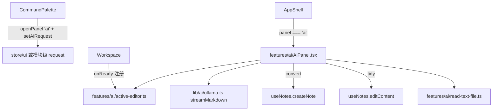

# Design Document

## Overview

在 `ollama-ai-engine` 之上加两个调用点，共用一个弹窗组件。

弹窗有两种模式：`convert`（空白输入，结果创建新笔记）与 `tidy`（预填当前笔记或选中段落，
结果替换原文）。两种模式的差别只有三处：系统提示词、初始输入、完成动作。
因此**一个组件带 mode 参数**，不做两个组件——避免两套几乎一样的流式渲染与告警逻辑各自漂移。

## Steering Document Alignment

本项目无 steering 文档。沿用上游约定，见 `ollama-ai-engine/design.md` 的同名章节
（React + zustand + Tailwind CSS 变量 + lucide-react + 严格 TS + 注释白名单制）。

## Code Reuse Analysis

### 复用既有件
- **`useUi` 的 `panel` / `openPanel` / `closePanel`**：弹窗按既有 panel 机制挂载
  （`AppShell.tsx` 已有 settings/shortcuts/graph/share/versions 五个同款）
- **`useNotes.createNote({ title, content, open })`**：创建新笔记，返回 id
- **`useNotes.editContent(id, content)`**：替换笔记正文，走既有编辑路径（因此可撤销、会同步）
- **`useNotes.contents[activeNoteId]`**：读当前笔记正文
- **`CommandPalette.tsx` 既有命令项结构**：`{ id, kind, label, icon, group, run }`，
  且已有「有 activeNote 才出现」的条件展开写法可照抄
- **`components/overlay`（`useEscape` / `useDialogFocus` / `useLockScroll`）**、
  **`components/primitives`（`Button` / `IconButton`）**、**`components/feedback`（`LoadingBlock`）**
- **`lib/i18n` 的 `t()`**

### 复用本功能既有件（来自 ollama-ai-engine）
- `lib/ai/ollama.ts` 的 `streamMarkdown` / `classifyAiError` /
  `AI_SYSTEM_PROMPT_CONVERT` / `AI_SYSTEM_PROMPT_TIDY`
- `lib/ai/guard.ts` 的 `LossReport`
- `lib/ai/config.ts` 的 `getAiConfig`

### 集成点
| 既有文件 | 改动 |
| --- | --- |
| `src/client/store/ui.ts` | `PanelName` 联合类型加 `'ai'` |
| `src/client/features/shell/AppShell.tsx` | lazy 导入 + `{panel === 'ai' && <AiPanel .../>}` 一行 |
| `src/client/features/command/CommandPalette.tsx` | 加两条命令（tidy 那条放进 `activeNote` 条件块） |
| `src/client/features/workspace/Workspace.tsx` | `onReady` 回调多调一次注册函数（1 行） |
| `src/shared/locales/{en-US,zh-CN}.ts` | 文案键 |

**为什么要动 `Workspace.tsx`**：`EditorView` 存在 `Workspace` 的局部 state
（`const [view, setView] = useState<EditorView | null>(null)`），命令面板够不到它。
需求 3.2 要求「有选中就只整理选中部分」，没有 view 就拿不到选区。
代价是 1 行；替代方案（放弃选区、只整理整篇）会让需求 3.2 无法满足。
`document.getSelection()` 在 CodeMirror 下不可靠，不采用。

## Architecture



### 模块划分
- `active-editor.ts`：模块级单例 holder，只有 `setActiveEditorView` / `getEditorSelection` 两个导出。
  不进 zustand —— EditorView 是可变的命令式对象，放进状态库只会制造无谓的重渲染
- `read-text-file.ts`：纯函数 + FileReader 封装，判类型、读文本、拒非文本
- `AiPanel.tsx`：唯一的 UI，带 mode
- 命令面板只负责「设置模式并开面板」，不含任何 AI 逻辑

## Components and Interfaces

### `src/client/features/ai/active-editor.ts`
- **职责**：持有当前 `EditorView`，提供选区读取
- **接口**：
  ```ts
  export function setActiveEditorView(view: EditorView | null): void
  export function getEditorSelection(): { text: string; from: number; to: number } | null
  ```
- **依赖**：`@codemirror/view` 的类型
- **说明**：`getEditorSelection` 在无选区或选区为空时返回 `null`

### `src/client/features/ai/read-text-file.ts`
- **职责**：把拖入的文件读成字符串，非文本类型明确拒绝
- **接口**：
  ```ts
  export interface ReadResult { ok: true; text: string; name: string }
  export interface ReadRejected { ok: false; reason: 'not-text' | 'too-large' | 'read-failed' }
  export function readTextFile(file: File): Promise<ReadResult | ReadRejected>
  ```
- **判类型**：`file.type.startsWith('text/')`，或后缀在 `.md/.markdown/.txt/.csv/.log/.json/.yaml/.yml` 内
  （很多系统对 `.md` 给的 MIME 是空串，只看 `type` 会误拒）
- **上限**：2 MB。超过直接拒，不静默截断

### `src/client/features/ai/AiPanel.tsx`
- **职责**：两种模式共用的弹窗
- **Props**：
  ```ts
  interface AiPanelProps { onClose: () => void }
  ```
  模式与初始输入从模块级 request（见下）读，不从 props 传 —— 因为 `AppShell` 的
  panel 渲染点是统一写法 `{panel === 'x' && <X onClose={closePanel}/>}`，
  多传参数就得改那行的形状
- **内部状态**：`input`、`output`、`running`、`loss`、`chunkProgress`、`error`
- **依赖**：`lib/ai/*`、`useNotes`、`useUi`、`active-editor.ts`、`read-text-file.ts`

### `src/client/features/ai/request.ts`
- **职责**：命令面板到面板之间传模式与初始输入
- **接口**：
  ```ts
  export type AiPanelMode = 'convert' | 'tidy'
  export interface AiPanelRequest {
    mode: AiPanelMode
    input: string
    target: { noteId: string; from: number; to: number } | null
  }
  export function setAiPanelRequest(request: AiPanelRequest): void
  export function takeAiPanelRequest(): AiPanelRequest | null
  ```
- **说明**：`target` 为 `null` 表示 convert 模式；非空表示 tidy 要写回的范围
  （`from === to === -1` 约定为「整篇」）

## Data Models

### AiPanelRequest（内存，不持久化）
```
mode:   'convert' | 'tidy'
input:  string            convert 时为空，tidy 时是整篇或选中文本
target: null | { noteId: string; from: number; to: number }
                          from/to 为 -1 表示整篇替换
```

无新增持久化。配置仍由 `ollama-ai-engine` 的 `inkstone_ai_config_v1` 负责。

## Error Handling

### 场景
1. **连不上本机 Ollama**
   - 处理：`classifyAiError` 分类，面板内展示对应文案
   - 用户看到：说明 + 一个「打开 AI 设置」按钮（`openPanel('settings')`）
   - 需求 4.1 要求「可操作」，光报错不给入口不算
2. **用户中止**
   - 处理：`AbortController.abort()`；已生成的部分留在预览区但不落笔记
   - 用户看到：停止后可以改输入重来，不会产生半截笔记（需求 1.5）
3. **内容丢失**（`loss` 非空）
   - 处理：面板顶部展示告警横幅，说明是 truncated 还是 short，并给出两条可操作建议
     （调小分片长度 / 换上下文窗口更大的模型）
   - 🔴 **仍允许创建笔记**（需求 2.4）：系统不替用户决定丢弃结果
4. **拖入非文本文件**
   - 处理：`readTextFile` 返回 `not-text`，面板 toast 明确拒绝
   - 用户看到：「只支持纯文本文件」——不做静默忽略（需求 1.6）
5. **tidy 时笔记已被切换或删除**
   - 处理：写回前校验 `target.noteId` 仍是 `activeNoteId` 且笔记存在，否则拒绝写回并提示
   - 用户看到：提示内容已过期，可复制结果自行处理

## Testing Strategy

### 单元测试（vitest）
- `read-text-file.test.ts`：`.md` 空 MIME 走后缀放行；`image/png` 拒；超 2 MB 拒
- `request.test.ts`：`take` 后再 `take` 返回 `null`（一次性语义）
- `active-editor.test.ts`：无 view 返回 `null`；空选区返回 `null`
- 变异测试：对上述每条断言逐个改坏实现确认转红

### 集成测试
- `npm run typecheck` / `test:unit` / `i18n:check` / `comments:check` / `deploy:check` 五门全绿

### 端到端（人工，需部署）
1. convert：贴入一段聊天记录 → 流式出 Markdown → 创建笔记 → 笔记内容正确
2. convert 长文：贴入超过 chunkChars 的文本 → 显示分片进度 → 结果完整
   （对照原文抽查首尾章节都在）
3. tidy 整篇：打开一篇笔记 → 命令面板「AI 整理当前笔记」→ 替换 → Ctrl+Z 能撤销
4. tidy 选中：选中一段 → 只有该段被替换
5. 无笔记时命令不出现
6. 断开 Ollama → 报错文案 + 「打开 AI 设置」按钮可用

## 本设计押的数（Assumptions to be checked）

| 押的 | 值 |
| --- | --- |
| 新增文件 | 4 源 + 3 测试 = 7 |
| 改动既有文件 | 5（ui.ts、AppShell.tsx、CommandPalette.tsx、Workspace.tsx、locales×2 算 2）实际 6 个文件 |
| 新增代码量 | 约 450–600 行（含测试） |
| 任务数 | 6 |
| 押：panel 机制能直接容纳一个带模式的弹窗而不改 AppShell 渲染点形状 | 已读代码确认写法，未实跑。因此模式走模块级 request 而非 props |
| 押：`editContent` 的改动能被 CodeMirror 的 undo 撤销 | **未验证**。若不能，需求 3.4 的「可撤销」会落空，届时改为在 tidy 面板里保留原文供用户手动回退，并在 conclusion 记下 |
| 押：流式渲染逐 token setState 不卡顿 | 未量。输出以千字符计，React 18 批处理应当够；若卡再引入节流 |

## Constitution Gates（宪法自检）

- [x] 简洁门：一个组件带 mode，不做两套；不做多轮追问精修；不做 OCR/PDF
- [x] 反抽象门：`active-editor` 是模块级 holder 而非状态库/依赖注入；
      `request` 是两个函数而非事件总线
- [x] 复用门：弹窗挂载、笔记创建/编辑、命令项、覆盖层 hook 全部用既有件；
      AI 协议与防丢失一律来自 `ollama-ai-engine`，本 spec 不重写
- [x] 精准门：`EditorToolbar.tsx` 不碰；`Workspace.tsx` 只加 1 行注册；
      不顺手重构命令面板或编辑器
