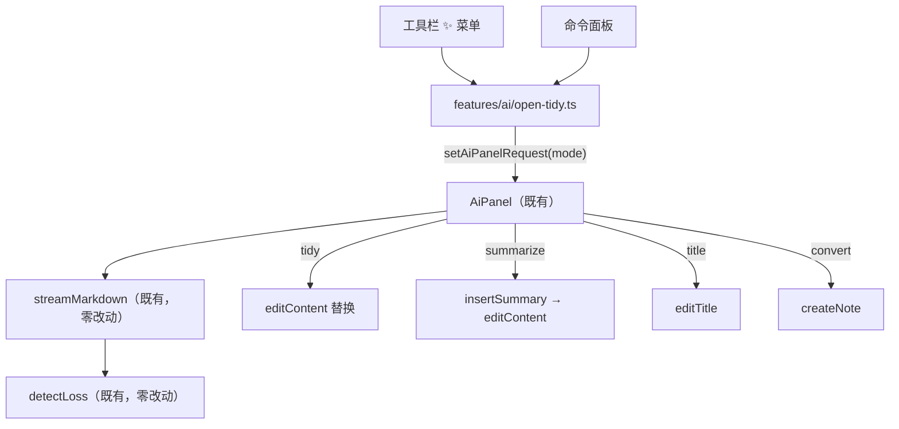

# Design Document

## Overview

在已有的 AI 弹窗上加两个模式，不新建任何基础设施。
差异全部压在**三处**：系统提示词、完成动作、弹窗宽度。



## Steering Document Alignment

无 steering 文档。沿用上游约定，见 `ollama-ai-engine/design.md` 同名章节。

## Code Reuse Analysis

### 零改动复用
- `streamMarkdown` / SSE 解析 / `detectLoss` / `splitForChunking` —— **一行不改**
- `AiPanel` 的流式渲染、告警横幅、中止、错误分类、打开设置
- `components/overlay` 的 `Modal`（`width` 参数现成）、`Menu` / `MenuItem`
- `EditorToolbar` 自己的 `MenuButton`（标题层级、更多样式都在用）
- `useNotes.editContent` / `editTitle`（后者签名 `(id, title) => void`）

### 集成点
| 文件 | 改动 |
| --- | --- |
| `lib/ai/ollama.ts` | +2 个提示词常量 |
| `features/ai/request.ts` | `AiPanelMode` 加 `'summarize' \| 'title'` |
| `features/ai/summary.ts` | **新建**：插入位置计算 + 标题规整（纯函数） |
| `features/ai/AiPanel.tsx` | 两个完成动作 + 标题模式窄布局 |
| `features/ai/open-tidy.ts` | +2 个触发函数 |
| `features/workspace/EditorToolbar.tsx` | ✨ 从按钮改菜单 |
| `features/command/CommandPalette.tsx` | +2 条命令 |
| `src/shared/locales/*` | 文案 |

## Architecture

### 新增文件：`src/client/features/ai/summary.ts`

本 spec **唯一有真实边界条件的逻辑**，因此抽成纯函数单独成文件、单独单测。

```ts
export function summaryInsertOffset(content: string): number
export function insertSummary(content: string, summary: string): string
export function normalizeTitle(raw: string): string
```

**`summaryInsertOffset` 的规则**（按序）：
1. 有 frontmatter（`---` 开头且有闭合 `---`）→ 跳到闭合行之后
2. 其后若首个非空行是一级标题（`# `）→ 再跳到该行之后
3. 返回该偏移量

**`insertSummary`** 在该偏移处插入 `> {summary}\n\n`，并保证前后各有一个空行。

**`normalizeTitle`**：取第一行 → 去首尾空白 → 去包裹的成对引号（`"` `'` `「」` `《》`）
→ 去首尾 `#` 与 Markdown 强调标记 → 去尾部句号 → 截断到 `LIMITS.titleMaxLength`（512）。

### 🔴 摘要用 `>` 而不是 `> [!NOTE]`

**实测依据**（非推断）：给一篇含 frontmatter + 一级标题 + `> [!NOTE]` 块的笔记跑
`deriveExcerpt`，实际返回：

```
"[!NOTE] 本周把发布流程从手工改成脚本，顺带修了两个静默失败。 背景 原来的发布要人工跑六条命令..."
```

`toPlainText` **不剥离** callout 标记，`[!NOTE]` 会原样出现在列表预览里。
用普通引用块则不会。**这一条决定了整个方案的形状**——若用 callout，
「让列表变好看」这个目标直接落空。

### 弹窗宽度

`Modal` 已有 `width` 参数（默认 560，`AiPanel` 现在传 720）。
`title` 模式传 **480**：生成的是一行字，720 会让输出区大片留白。
其余模式维持 720。

## Components and Interfaces

### `AiPanelMode` 扩展
```ts
export type AiPanelMode = 'convert' | 'tidy' | 'summarize' | 'title'
```
`AiPanelTarget` 不变——`summarize` 与 `title` 都作用于整篇，
沿用 `WHOLE_NOTE_RANGE` 哨兵与既有的 `originalText` 过期校验。

### 提示词（`lib/ai/ollama.ts`）
- `AI_SYSTEM_PROMPT_SUMMARIZE`：要求一到两句概括、与原文同语言、
  只输出摘要本身（不带「摘要：」这类前缀）、不复述
- `AI_SYSTEM_PROMPT_TITLE`：要求单行短标题、与原文同语言、
  无 Markdown 标记、无引号、不以句号结尾

两者都拼接既有的 `strictInstruction()` 防注入约束。

### 完成动作（`AiPanel.tsx`）
| mode | 动作 |
| --- | --- |
| `summarize` | 校验 `originalText` 未变 → `editContent(id, insertSummary(current, output))` |
| `title` | `editTitle(id, normalizeTitle(output))` |

`summarize` 复用既有的 `isTargetUnchanged` 守卫（生成期间笔记被改则拒绝写回）。
`title` **不需要该守卫**——它整体替换标题，不依赖正文偏移量。

### 工具栏菜单（`EditorToolbar.tsx`）
```tsx
<MenuButton buttonRef={aiRef} label={t("workspace.ai_actions")} ...>
  <Sparkles size={14}/>
</MenuButton>
<Menu anchor={aiRef} items={aiItems} width={176} .../>
```
`aiItems` 三项，`onSelect` 分别调 `open-tidy.ts` 的三个函数。

## Data Models

无新增持久化。摘要是正文的一部分，标题是既有字段。

## Error Handling

1. **无打开笔记** → 命令不出现（复用既有 `activeNote` 条件块）；
   工具栏本身只在有笔记时渲染
2. **生成期间笔记被改**（仅 `summarize`）→ 复用既有 `ai.target_note_changed` 文案拒绝写回
3. **模型返回空**或规整后为空（`title`）→ 拒绝写回并提示，不把空标题写进去
4. 其余复用 `classifyAiError`

## Testing Strategy

### 单元测试（`features/ai/summary.test.ts`）
- `summaryInsertOffset`：无 frontmatter 无标题 / 有 frontmatter / 有标题 /
  两者都有 / 空正文 / 只有 frontmatter / frontmatter 未闭合（不能误判）
- `insertSummary`：插入后前后空行正确、原内容一字不丢、幂等调用两次会有两个块（符合需求 1.6）
- `normalizeTitle`：多行取首行、去成对引号（四种）、去 `#`、去尾句号、
  超长截断、纯空白返回空串
- 每条关键断言做反向验证（改坏实现确认转红）

### 端到端（需部署）
1. 摘要：生成 → 插入 → 列表预览确实变成那句话（**这是本 spec 的验收核心**）
2. 摘要：Ctrl+Z 能撤销
3. 标题：生成 → 标题栏更新
4. 工具栏菜单三项都能触发
5. 无笔记时命令不出现

## 本设计押的数（Assumptions to be checked）

| 押的 | 值 |
| --- | --- |
| 新增文件 | 2（`summary.ts` + 测试） |
| 改动既有文件 | 7 |
| 新增代码量 | 350–450 行（含测试） |
| 任务数 | 6 |
| 押：`>` 引用块能让 excerpt 变好看 | **已实测 callout 会漏标记**，但**普通 `>` 块的 excerpt 实际输出未单独验证**，实现时补测 |
| 押：`editTitle` 会触发同步与撤销 | 未验证。`editContent` 已确认可撤销，`editTitle` 是同一 store 的同类方法，但**未实测** |
| 押：工具栏改菜单不影响移动端布局 | 未验证。`MenuButton` 有 `mobile` 参数，照传即可 |

## Constitution Gates（宪法自检）

- [x] 简洁门：不做「摘要去重」「隐藏标记」「摘要历史」——需求 1.6 明确排除
- [x] 反抽象门：不为两个新模式建策略层，`AiPanel` 里就是两个分支
- [x] 复用门：引擎、防丢失、弹窗、菜单组件全部复用；触发逻辑收敛在既有 `open-tidy.ts`
- [x] 精准门：`guard.ts` / `config.ts` / Worker / schema 一律不碰
