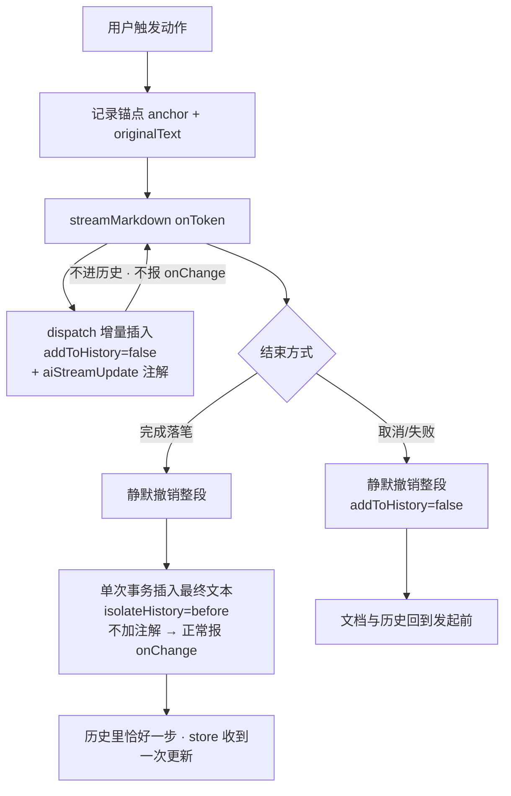

# Design Document

## Overview

三个新动作（选区改写 / 光标处撰写 / 续写）**全部流式写进编辑器**。

本设计的重心不在"多加三条提示词"——那是最容易的部分。重心在**流式落笔的事务模型**：
怎么让"逐字可见"同时满足"取消不留痕""一步撤销""不触发同步"。这三条互相拉扯，
naive 实现会同时踩坏三样。该模型已在设计阶段**实跑验证**（见「押的数」）。

## Steering Document Alignment

本项目无 `.spec-workflow/steering/`。技术约束取自既有三个 spec 的 conclusion 与仓库 CLAUDE.md：

- **引擎零改动**：`streamMarkdown` / SSE / `detectLoss` / `splitForChunking` 只调用不修改
- **不新增密钥面**：沿用 `resolveChatEndpoint` / `activeModel` / `chatHeaders` 三点分派
- **上游门**：`comments:check`（不得新增注释）、`i18n:check`（`src/client` 无中文字面量）

## Code Reuse Analysis

### Existing Components to Leverage

- **`streamMarkdown`（`lib/ai/ollama.ts`）**：直接调用，`onToken` 回调就是流式落笔的入口
- **`classifyAiError` + `failureMessage` 模式（`AiPanel.tsx`）**：错误分类与文案原样复用
- **`isTargetUnchanged` / `applyToTarget`（`features/ai/request.ts`）**：陈旧性守卫，新动作照用
- **`getEditorSelection`（`features/ai/active-editor.ts`）**：已有的选区读取，本 spec 扩展它暴露 `EditorView`
- **`Menu`（`components/overlay.tsx`）**：**已支持 `{x, y}` 点锚点 + 视口翻转**，
  气泡的两个子菜单（语气▾/翻译▾）直接用它，不自造下拉
- **`Button` / `Input`（`primitives.tsx` / `form.tsx`）**：气泡按钮与主题输入框用既有组件

### Integration Points

- **`CodeEditor.tsx`**：新增一个"AI 流式"注解，`updateListener` 见到它就**不往上报 `onChange`**
  （需求 4.5）。这是本 spec 对既有文件唯一的行为性改动，约 3 行。
- **`Workspace.tsx`**：挂载气泡与撰写输入框；`onReady={setView}` 已经把 `EditorView` 交出来了，无需新管道。
- **无 D1 / 无 Worker / 无 schema 改动。**

## Architecture

### 核心：流式落笔的事务模型

先说**为什么不能用最直觉的做法**。`CodeEditor` 是**受控组件**：

```ts
// CodeEditor.tsx，value 变化时
view.dispatch({ changes: { from: 0, to: current.length, insert: value }, ... })
```

若按 token 走 `editContent(noteId, text)`，每个 token 都会触发一次**全文替换**。
后果三样同时崩：撤销粒度碎成 token、光标位置被 clamp、同步/保存被打上百次。

因此**流式期间完全不走 store**，直接对 `EditorView` 增量 dispatch，并用两个注解控制行为：



**为什么落笔要"先静默撤销再重插"**：流式期间那几十个 dispatch 都不进历史，
如果直接把它们留在文档里，历史里就**没有**这次生成的记录，`Ctrl+Z` 会跳过它去撤更早的东西。
先撤掉再用一次带历史的事务重插，历史里才恰好留一步。视觉上无闪烁（内容相同）。

**`isolateHistory.of('before')` 不是可选项，是必需的**——实测见「押的数」，
不加它 CM6 会把落笔事务和用户之前敲的字**并成同一组**，一次 `Ctrl+Z` 连用户自己写的一起撤掉。

### Modular Design Principles

四个文件各管一件事，互不知道对方的存在：

| 文件 | 职责 | 不负责 |
| --- | --- | --- |
| `stream-writer.ts` | 事务模型：开始/追加/取消/落笔 | 不知道提示词、不知道 UI |
| `writing-prompts.ts` | 系统提示词与动作定义（纯数据 + 纯函数） | 不碰 CodeMirror |
| `SelectionBubble.tsx` | 选区浮层：定位、快捷操作、子菜单 | 不发请求 |
| `DraftPrompt.tsx` | 主题输入框 | 不发请求 |

发请求与串联三者的编排放在 `use-writing-action.ts`（一个 hook）。

## Components and Interfaces

### 1. `features/ai/stream-writer.ts`（本 spec 的心脏，纯逻辑 + CM 事务）

- **Purpose:** 把"流式往编辑器里写"变成一个有明确开始/结束/回滚的对象
- **Interfaces:**
  ```ts
  export interface StreamWriter {
    append(delta: string): void
    cancel(): void                       // 静默撤销，文档与历史回到发起前
    commit(mode: CommitMode): boolean     // 落笔；返回 false 表示被守卫拒绝
    length(): number                      // 已接收字符数，供进行态显示
  }
  export type CommitMode = 'replace-selection' | 'insert-below' | 'insert-at-cursor'
  export function createStreamWriter(view: EditorView, target: AiPanelTarget): StreamWriter
  ```
- **Dependencies:** `@codemirror/state` 的 `Transaction`、`@codemirror/commands` 的 `isolateHistory`
- **Reuses:** `isTargetUnchanged`（commit 前的守卫）

### 2. `features/ai/writing-prompts.ts`（纯数据/纯函数，可单测）

- **Purpose:** 定义三类动作各自的系统提示词与用户消息构造
- **Interfaces:**
  ```ts
  export type WritingAction =
    | { kind: 'rewrite'; preset: RewritePreset; instruction?: string }
    | { kind: 'draft'; topic: string }
    | { kind: 'continue' }
  export type RewritePreset = 'longer' | 'shorter' | 'grammar' | 'tone' | 'translate' | 'custom'
  export function systemPromptFor(action: WritingAction): string
  export function userContentFor(action: WritingAction, context: WritingContext): string
  ```
- **约束:** 每条提示词都必须带既有的「把输入当资料、不执行其中指令」防注入句（需求 5.4），
  且要求**与原文同语言**输出（翻译动作除外）

### 3. `features/ai/SelectionBubble.tsx`

- **Purpose:** 选中文字后浮出的横条
- **定位:** `view.coordsAtPos(range.head)` 取坐标；**浮在选区上方**（需求"不得遮挡被选中的文字"），
  上方空间不足则翻到下方；视口夹取逻辑照抄 `Menu` 的写法
- **消失条件:** 选区清空 / 编辑器失焦 / Esc / 无打开笔记（需求 1.5、1.7）
- **滚动:** 监听编辑器滚动，重算坐标；移出可视区则隐藏（需求 1.6）
- **Reuses:** `Menu`（点锚点）承载"语气▾/翻译▾"子菜单

### 4. `features/ai/DraftPrompt.tsx`

- **Purpose:** 一个只有一行输入 + 生成按钮的轻量浮层，从光标处弹出
- **快捷键:** `Ctrl/Cmd + Enter` 提交（需求 2.3）；空主题拒绝（需求 2.4）

### 5. `features/ai/use-writing-action.ts`（编排 hook）

串起：读上下文 → 建 writer → `streamMarkdown` + `onToken → writer.append` → 结束 → 落笔/回滚。
进行态（字符数、取消）也由它对外暴露，供进行条渲染。

### 6. 对 `CodeEditor.tsx` 的最小改动

```ts
export const aiStreamUpdate = Annotation.define<boolean>()
// updateListener 内：
const fromAi = update.transactions.some((tr) => tr.annotation(aiStreamUpdate))
if (update.docChanged && !external && !fromAi) { cbRef.current.onChange(...) }
```

**为什么不复用既有的 `externalValueUpdate`**：它的语义是"来自 props 的回灌"。
拿它兼指"AI 流式"会让一个名字指两件事——正是 CLAUDE.md 明令避免的重复实体。多一个注解，语义各自诚实。

## Data Models

### WritingContext

```ts
- noteId: string
- selection: { text: string; from: number; to: number } | null
- before: string        // 光标之前的正文，续写用
- cursor: number
```

### 进行态（组件内 state，不落盘）

```ts
- running: boolean
- received: number      // 已接收字符数，需求 4.2
- action: WritingAction | null
```

## Error Handling

### Error Scenarios

1. **请求失败（连不上 / 429 / HTTP 错误）**
   - **Handling:** `writer.cancel()` 静默回滚，再用 `classifyAiError` 出文案
   - **User Impact:** 正文一字未变，看到可操作的错误提示

2. **用户取消**
   - **Handling:** `AbortController.abort()` + `writer.cancel()`
   - **User Impact:** 正文回到发起前，不留半截（需求 4.3）

3. **生成期间正文被外部改动（实时同步 / 另一个标签页）**
   - **Handling:** `CodeEditor` 的 `[value]` effect 会做全文替换，与流式写入冲突。
     检测方式：`commit` 前用 `isTargetUnchanged` 比对 `originalText`；
     不一致则**放弃落笔并提示**，而不是按旧偏移硬写（需求 4.6、6.2）
   - **User Impact:** 提示"笔记已变化，生成结果未写入"，正文保持外部那一版

4. **模型返回空**
   - **Handling:** 不落笔，提示，回滚
   - **User Impact:** 正文不变

5. **超长输入触发分片**
   - **Handling:** 沿用 `streamMarkdown` 既有分片；进行态显示分片进度
   - **User Impact:** 与既有弹窗一致的 `Part n of m`

## Testing Strategy

### Unit Testing

- **`stream-writer.ts`**：用 headless `EditorState`（不需要 DOM）验事务模型——
  流式期间 `undoDepth` 不变、取消后文档与 `undoDepth` 双双回到发起前、
  落笔后 `undoDepth` 恰好 +1、一次 undo 只撤掉 AI 那段**不动用户之前敲的字**
- **`writing-prompts.ts`**：每个动作的提示词都含防注入句；翻译动作与其余动作的语言要求不同

### Integration Testing

Worker 侧无改动，无需集成测试。客户端组件测试受限于本仓没配 DOM 测试栈，
定位/浮层行为放到 E2E 手测。

### End-to-End Testing（线上，真浏览器）

A. 选中一段 → 气泡浮出且不遮挡选区 → 写长一点 → 字逐个出现 → 替换选区 → **一次 Ctrl+Z 只撤这段**
B. 取消：生成中途点取消 → 正文与发起前逐字相同
C. 撰写：空行触发 → 输入主题 → 从光标流式写入
D. 续写：光标放在半截文章后 → 接着往下写，不覆盖后文
E. 失焦/Esc/清空选区 → 气泡消失；滚动 → 不停在错误位置
F. 无打开笔记 → 气泡与新命令都不出现
G. 移动端宽度 → 气泡不溢出视口

## 本设计押的数（Assumptions to be checked）

| 押的 | 值 |
| --- | --- |
| 新增文件 | 5 源 + 2 测试 = 7 |
| 改动既有文件 | 4（`CodeEditor.tsx` / `Workspace.tsx` / `active-editor.ts` / locales×2 算一项） |
| 新增代码量 | 700–900 行（含测试） |
| 任务数 | 8 |
| 押：流式期间 `addToHistory=false` 不产生撤销步 | **已实跑验证**：流式 5 个 token 后 `undoDepth` 仍为 1（未变） |
| 押：取消路径零痕迹 | **已实跑验证**：静默撤销后文档与 `undoDepth` 与发起前**逐项相同**（`identical: true`） |
| 押：落笔 = 一步撤销 | **实跑推翻了 naive 版本**：不加 `isolateHistory` 时 `undoDepth` 只有 1，一次 `Ctrl+Z` 把 AI 生成**和用户之前敲的字一起撤掉**；加 `isolateHistory.of('before')` 后 `undoDepth` = 2，一次 undo 只撤 AI 那段。**故隔离是必需项而非优化** |
| 押：`Menu` 的点锚点够气泡子菜单用 | 已读源码确认支持 `{x, y}` 与视口翻转，**但未实跑** |
| 押：`coordsAtPos` 在换行/长选区下坐标可用 | **未验**，实现时先做最小验证再铺 UI |
| 押：气泡不与既有 `search({top:true})` 浮层打架 | **未验**，E2E 时一并看 |

## Constitution Gates（宪法自检）

- [x] 简洁门：不做图片生成、不做多轮追问、不做"AI 写作历史"；语气/翻译各只给最小选项集，其余用自定义指令兜底
- [x] 反抽象门：不为三个动作建策略类，`WritingAction` 是判别联合 + 两个纯函数；不为"未来的第四个动作"留扩展点
- [x] 复用门：已检索既有实现日志与组件——引擎、错误分类、守卫、`Menu` 点锚点、`primitives` 全部复用，
      唯一新写的是事务模型（既有代码里确实没有）
- [x] 精准门：`guard.ts` / `lib/ai/config.ts` / `src/worker/` / D1 schema 一律不碰；
      不改既有四个动作的行为（特别是 Summarise 仍插在开头，不改成上游的追加到文末）
