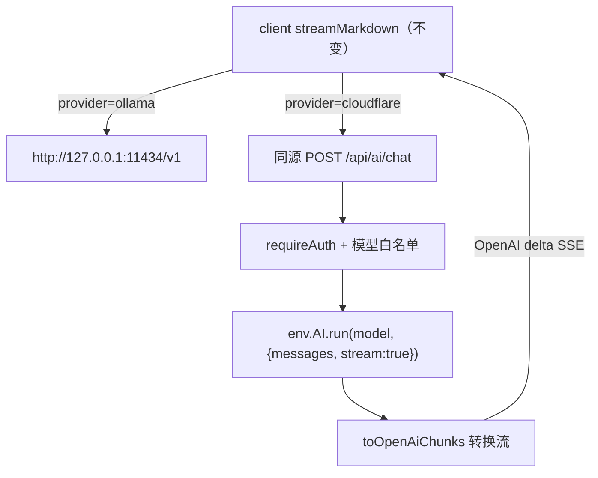

# Design Document

## Overview

在既有 AI 引擎旁并列接入第二个供应商。核心手法是**把差异压在最外层的 URL 上**：
客户端仍然只会说一种协议（OpenAI 兼容 SSE），Worker 负责把 Workers AI 翻译成那种协议。

因此 `streamMarkdown`、`parseSseLine`、`readSseStream`、`detectLoss`、`splitForChunking`
**一行都不用改** —— 云端模式只是把请求打到 `/api/ai/chat` 而不是 `http://127.0.0.1:11434/v1/chat/completions`。



## Steering Document Alignment

无 steering 文档。沿用上游约定，见 `ollama-ai-engine/design.md` 同名章节。
服务端另需遵守：路由用 Hono、`requireAuth` 来自 `../middleware/auth`、
错误抛 `ApiError`（`../lib/errors`）、请求体用 `readJson`（`../lib/request`）。

## Code Reuse Analysis

### 复用既有件（服务端）
- **`env.AI`**：已存在的 Workers AI 绑定，语义搜索在用（`src/worker/mcp/ai-search.ts`）。
  类型是 `run: <T = unknown>(model: string, inputs: unknown) => Promise<T>`，
  流式调用取 `run<ReadableStream>(...)`
- **`requireAuth`**：`tagsRoutes` 等的标准写法 `routes.use('*', requireAuth)`
- **`ApiError` / `readJson` / `JSON_BODY_LIMITS`**：错误与请求体读取

### 复用既有件（客户端）
- **`streamMarkdown` / SSE 解析 / `detectLoss` / `splitForChunking`**：**零改动**
- **`AiSettings` 的既有控件**：`SettingRow` / `Select` / `Switch` / `Input`

### 集成点
| 文件 | 改动 |
| --- | --- |
| `src/worker/app.ts` | `app.route('/api/ai', aiRoutes)` 一行 + import |
| `src/client/lib/ai/config.ts` | `AiConfig` 加 `provider` 与 `cloudflareModel` |
| `src/client/lib/ai/ollama.ts` | 只改「请求打到哪个 URL」这一处 |
| `src/client/features/settings/AiSettings.tsx` | 供应商切换 + 云端模型下拉 + 隐私提示 |
| `src/shared/locales/{en-US,zh-CN}.ts` | 文案 |

## Architecture

### 新增文件
| 文件 | 职责 |
| --- | --- |
| `src/worker/lib/workers-ai-stream.ts` | 纯函数：把上游 chunk 翻成 OpenAI delta；建 TransformStream |
| `src/worker/lib/workers-ai-stream.test.ts` | 单测 |
| `src/worker/routes/ai.ts` | 路由：鉴权、校验模型、调 `env.AI`、接转换流 |
| `src/shared/ai-models.ts` | 允许清单（服务端校验与客户端下拉**共用同一份**） |

允许清单放 `src/shared/` 是刻意的：服务端要用它挡非法模型，客户端要用它填下拉。
放两份必然漂移，到时候界面上能选、服务端却拒绝。

### 模块划分
- 转换逻辑是**纯函数** → 可单测、可做变异测试
- 路由只做编排，不含解析细节
- 客户端的 provider 分派只出现在 `resolveEndpoint()` 一处

## Components and Interfaces

### `src/shared/ai-models.ts`
```ts
export interface CloudflareModel { id: string; label: string }
export const CLOUDFLARE_AI_MODELS: CloudflareModel[]
export const DEFAULT_CLOUDFLARE_MODEL: string
export function isAllowedCloudflareModel(id: string): boolean
```
清单（均在免费额度内，模型 ID 已逐字核对官方文档）：

| id | 说明 |
| --- | --- |
| `@cf/qwen/qwen3-30b-a3b-fp8` | 默认。性价比最好，估算 ~142 篇/天 |
| `@cf/google/gemma-4-26b-a4b-it` | ~137 篇/天 |
| `@cf/openai/gpt-oss-20b` | ~110 篇/天 |
| `@cf/openai/gpt-oss-120b` | 更强，额度消耗更快 |
| `@cf/meta/llama-4-scout-17b-16e-instruct` | |
| `@cf/meta/llama-3.3-70b-instruct-fp8-fast` | 输出单价贵约 6 倍，估算 ~21 篇/天 |
| `@cf/mistralai/mistral-small-3.1-24b-instruct` | |

**不收录**需付费的 5 个（`kimi-k2.6`、`kimi-k2.7-code`、`glm-5.2`、
`deepseek-v4-flash-0731`、`deepseek-v4-pro-0813`）——放进来只会让用户撞一堵付费墙。

### `src/worker/lib/workers-ai-stream.ts`
```ts
export function extractDelta(payload: unknown): string | null
export function toOpenAiChunk(delta: string, model: string): string
export function transformWorkersAiStream(upstream: ReadableStream<Uint8Array>, model: string): ReadableStream<Uint8Array>
```
- `extractDelta` 是本 spec 的核心：**两种上游形状都吃**
  - `{ response: "..." }` → 取 `response`
  - `{ choices: [{ delta: { content: "..." } }] }` → 取 `content`
  - 其它/无法识别 → 返回 `null`（跳过，不抛错）
- `transformWorkersAiStream` 逐行读上游 SSE，转成
  `data: {"choices":[{"delta":{"content":"..."}}]}`，结束时补 `data: [DONE]`
- 跨 chunk 半行的缓冲逻辑与客户端 `readSseStream` 同款

### `src/worker/routes/ai.ts`
```
POST /api/ai/chat
  requireAuth
  body: { model: string, messages: ChatMessage[], max_tokens?: number }
  200 → text/event-stream（OpenAI delta 形状）
  400 → 模型不在允许清单 / 请求体不合法
  401 → 未登录（requireAuth）
  503 → env.AI 缺失
```

### `src/client/lib/ai/ollama.ts`（唯一改动点）
```ts
function resolveEndpoint(config: AiConfig, path: 'chat' | 'models'): string
```
- `provider === 'cloudflare'` 且 `path === 'chat'` → `/api/ai/chat`
- 否则 → `${normalizeBaseUrl(config.baseUrl)}/chat/completions` 或 `/models`
- 云端模式下 `listModels` 不发请求，直接返回允许清单

请求体里的 `model` 按 provider 取 `config.cloudflareModel` 或 `config.model`。

### `AiSettings.tsx`
- 顶部加供应商 `Segmented` 或 `Select`（用哪个取决于既有件哪个更贴，实现时定）
- `provider === 'cloudflare'` → 显示云端模型下拉 + 红色隐私提示，
  隐藏服务地址与「测试连接」（需求 3.6）
- `provider === 'ollama'` → 与现在完全一致

## Data Models

### AiConfig（localStorage `inkstone_ai_config_v1`，新增两个字段）
```
provider:        'ollama' | 'cloudflare'   默认 'ollama'
cloudflareModel: string                    默认 @cf/qwen/qwen3-30b-a3b-fp8
```
既有字段不变。`mergeAiConfig` 的深合并会让老配置自动补上这两个默认值，**无需迁移**。

## Error Handling

1. **模型不在允许清单** → 400，界面提示重新选择模型
2. **`env.AI` 缺失** → 503 + 专门文案（部署时删掉了 `[ai]` 绑定）
3. **免费额度耗尽** → Workers AI 返回错误，路由原样把状态码与信息带出；
   客户端识别为额度问题并给专门文案：**说明是 Cloudflare 免费额度用尽、
   UTC 00:00 重置、与语义搜索共用、可切回本地 Ollama**
4. **无法识别的上游 chunk** → 跳过该 chunk，继续读流（宁可少一段也不整体失败）
5. 其余复用 `classifyAiError`

## Testing Strategy

### 单元测试（vitest）
- `workers-ai-stream.test.ts`
  - `extractDelta`：原生形状、OpenAI 形状、空 delta、缺字段、非对象 → 各自结果
  - `transformWorkersAiStream`：跨 chunk 半行、多 chunk 拼接、`[DONE]` 收尾、
    无法识别的 chunk 被跳过而不中断
- `ai-models.test.ts`：允许清单非空、默认模型在清单内、
  `isAllowedCloudflareModel` 拒绝任意字符串与付费模型 id
- 每条关键断言做变异测试

⚠️ **注意**：`src/worker` 依赖 `cloudflare:` 协议模块，本仓 vitest 没配 workers pool，
**路由本身写不了集成测试**。因此把逻辑尽量挤进纯函数文件里
（`workers-ai-stream.ts` 不 import 任何 `cloudflare:` 模块），路由留薄。

### 端到端（需部署）
1. 切到云端供应商，用一段短文本跑 convert → 流式出结果 → 落成笔记
2. **实测记录上游真实 chunk 形状**（本 spec 押的数之一，见下）
3. 切回本地供应商 → 行为与之前一致（回归）
4. 请求一个不在清单里的模型 → 400

## 本设计押的数（Assumptions to be checked）

| 押的 | 值 |
| --- | --- |
| 新增文件 | 4 源 + 2 测试 = 6 |
| 改动既有文件 | 5 |
| 新增代码量 | 400–550 行（含测试） |
| 任务数 | 6 |
| 押：上游 chunk 形状 | **不确定，故两种都实现**。官方 streaming 文档 404，搜索结果显示较新的可能已是 OpenAI 形状，旧文档写 `{"response":"..."}`，且可能随模型而异。上线后实测记录 |
| 押：`env.AI.run(..., {stream:true})` 返回可直接消费的 ReadableStream | 依据官方文档示例，未实跑 |
| 押：免费额度耗尽时的错误形状 | **完全未知**——没撞过。届时按实际返回补文案，不预先编造判据 |
| 押：客户端引擎零改动（除 URL 分派） | 设计如此，实现时若被迫改动要在 conclusion 记下 |

## Constitution Gates（宪法自检）

- [x] 简洁门：不做 AI Gateway、不做用量统计面板、不做按模型的额度预估显示——需求外
- [x] 反抽象门：**这次引入 provider 分派是有依据的**（两个真实现），
      但仍不建 provider 接口层，只在 `resolveEndpoint` 一处分派
- [x] 复用门：允许清单前后端共用一份；客户端引擎与防丢失逻辑零改动；
      服务端复用 `requireAuth` / `ApiError` / `readJson`
- [x] 精准门：`guard.ts`、`AiPanel.tsx`、`request.ts`、`EditorToolbar.tsx`、
      `CommandPalette.tsx` 一律不碰
