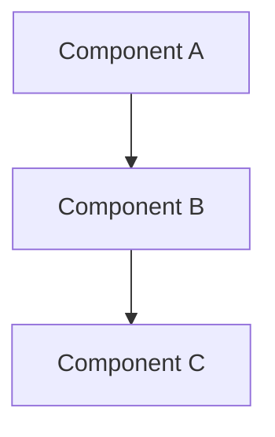

# Design Document

## Overview

[High-level description of the feature and its place in the overall system]

## Steering Document Alignment

### Technical Standards (tech.md)
[How the design follows documented technical patterns and standards]

### Project Structure (structure.md)
[How the implementation will follow project organization conventions]

## Code Reuse Analysis
[What existing code will be leveraged, extended, or integrated with this feature]

### Existing Components to Leverage
- **[Component/Utility Name]**: [How it will be used]
- **[Service/Helper Name]**: [How it will be extended]

### Integration Points
- **[Existing System/API]**: [How the new feature will integrate]
- **[Database/Storage]**: [How data will connect to existing schemas]

## Architecture

[Describe the overall architecture and design patterns used]

### Modular Design Principles
- **Single File Responsibility**: Each file should handle one specific concern or domain
- **Component Isolation**: Create small, focused components rather than large monolithic files
- **Service Layer Separation**: Separate data access, business logic, and presentation layers
- **Utility Modularity**: Break utilities into focused, single-purpose modules



## Components and Interfaces

### Component 1
- **Purpose:** [What this component does]
- **Interfaces:** [Public methods/APIs]
- **Dependencies:** [What it depends on]
- **Reuses:** [Existing components/utilities it builds upon]

### Component 2
- **Purpose:** [What this component does]
- **Interfaces:** [Public methods/APIs]
- **Dependencies:** [What it depends on]
- **Reuses:** [Existing components/utilities it builds upon]

## Data Models

### Model 1
```
[Define the structure of Model1 in your language]
- id: [unique identifier type]
- name: [string/text type]
- [Additional properties as needed]
```

### Model 2
```
[Define the structure of Model2 in your language]
- id: [unique identifier type]
- [Additional properties as needed]
```

## Error Handling

### Error Scenarios
1. **Scenario 1:** [Description]
   - **Handling:** [How to handle]
   - **User Impact:** [What user sees]

2. **Scenario 2:** [Description]
   - **Handling:** [How to handle]
   - **User Impact:** [What user sees]

## Testing Strategy

### Unit Testing
- [Unit testing approach]
- [Key components to test]

### Integration Testing
- [Integration testing approach]
- [Key flows to test]

### End-to-End Testing
- [E2E testing approach]
- [User scenarios to test]

## 本设计押的数（Assumptions to be checked）

<这次赌的数字与判断：规模 / 耗时 / 任务数 /「我认为 X 会成立」。3–5 行即可，
不确定就写「未量，按 <某处> 的形状假定」——**写下「没量」本身也是一个可被推翻的押注**。>

| 押的 | 值 |
| --- | --- |
|  |  |

> 为什么要写：conclusion 的「预估 vs 实测」需要一个**当时就写下的**基线。
> 没有它，那一节只能靠回忆补——而**事后回想的预测总是偏向让故事说得通**，
> 补出来的是自我印证，不是校准。
> 实测（2026-08-04）：本仓抽查 3 份 conclusion，**2 份的预估列是追认的**——
> 那两个 spec 的 design 里「预估 / 假定」命中为 0。

## Constitution Gates（宪法自检）

> 提交设计前逐项自检（specloop 约定，对应「简洁优先/精准修改」纪律）；过不了的项要么改设计、要么写明豁免理由。

- [ ] 简洁门：没有需求之外的功能；没有「以防万一」的灵活性/配置项
- [ ] 反抽象门：一次性代码未做抽象；没有为单一实现引入接口层
- [ ] 复用门：已检索既有组件/实现日志，无重复造轮子
- [ ] 精准门：只动与本 spec 直接相关的模块；不顺手重构无关代码
